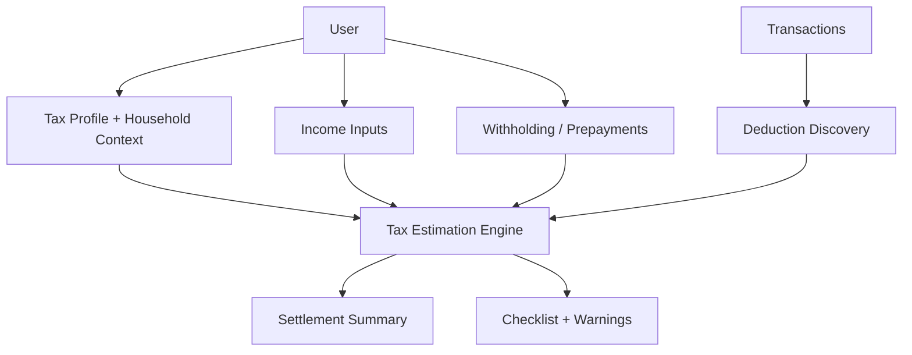
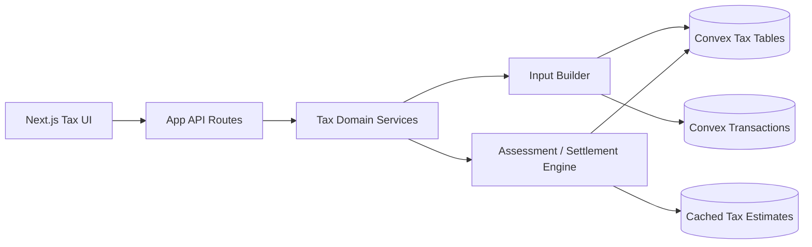
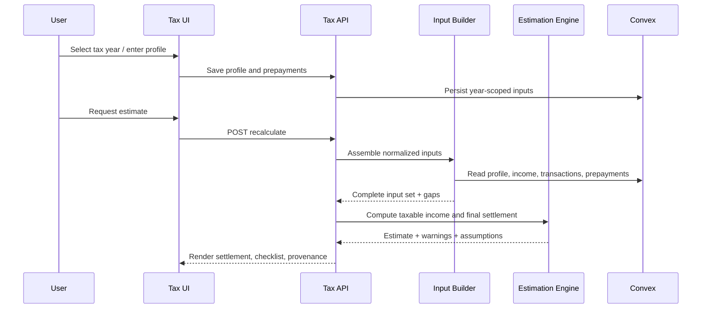
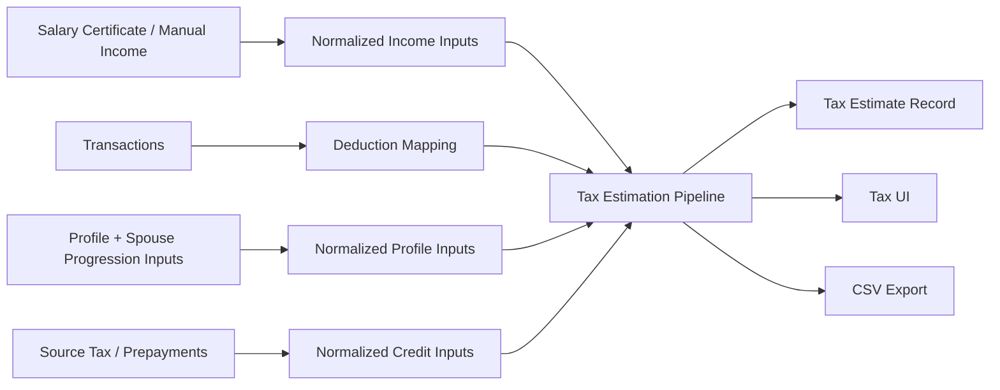

# Swiss Tax Estimation Refactor Plan

## Context

The current tax section is implemented as a transaction-driven deduction summary. The core logic in [lib/tax/engine.ts](/Users/atem/sites/finance/fin-expenses/finance-dashboard/lib/tax/engine.ts:1) computes:

- `total_income` from all positive transactions
- `total_deductible_expenses` from configured expense categories
- `total_non_deductible_expenses` from configured non-deductible categories
- `estimated_taxable_income = total_income - total_deductible_expenses`

The main UI in [components/tax/tax-dashboard-client.tsx](/Users/atem/sites/finance/fin-expenses/finance-dashboard/components/tax/tax-dashboard-client.tsx:1) surfaces those values as the primary tax summary. The API layer in [app/api/tax/summary/route.ts](/Users/atem/sites/finance/fin-expenses/finance-dashboard/app/api/tax/summary/route.ts:1), [app/api/tax/income/route.ts](/Users/atem/sites/finance/fin-expenses/finance-dashboard/app/api/tax/income/route.ts:1), [app/api/tax/deductions/route.ts](/Users/atem/sites/finance/fin-expenses/finance-dashboard/app/api/tax/deductions/route.ts:1), [app/api/tax/checklist/route.ts](/Users/atem/sites/finance/fin-expenses/finance-dashboard/app/api/tax/checklist/route.ts:1), and [app/api/tax/export/csv/route.ts](/Users/atem/sites/finance/fin-expenses/finance-dashboard/app/api/tax/export/csv/route.ts:1) all depend on the same summary shape.

The review in [docs/app-review-tax-estimations.md](/Users/atem/sites/finance/fin-expenses/finance-dashboard/docs/app-review-tax-estimations.md:1) correctly identifies that this model conflates three separate concepts:

- taxable income
- taxes already withheld at source
- informational expenses that do not affect taxable income

The codebase currently has no persistence model for taxpayer profile data, spouse progression inputs, salary-certificate data, payroll withholding totals, or ordinary-assessment outputs. Convex stores transactions and exclusions only in [convex/schema.ts](/Users/atem/sites/finance/fin-expenses/finance-dashboard/convex/schema.ts:1).

## Decision

Refactor the tax section from a deduction-centric expense report into a tax-estimation workflow with four explicit domains:

1. Tax profile and filing context
2. Taxable income and allowed deductions
3. Taxes already withheld or prepaid
4. Final estimated settlement

The target product flow should be:

1. Capture or import taxpayer profile and assessment context for a tax year.
2. Derive gross Swiss taxable income from salary-certificate data first, with transaction-derived data used only as supporting evidence or fallback.
3. Apply allowed deductions using explicit legal/configured rules.
4. Run an ordinary-assessment estimation step that outputs estimated federal, cantonal, and municipal tax.
5. Subtract actual source tax already withheld and any prepayments.
6. Present the user-facing result as additional amount due, no balance, or refund.

This should remain an estimation feature, not a tax-filing engine. The plan assumes legal/tax-rule uncertainty will be handled through configurable rules plus transparent assumptions, not hidden heuristics.

## Alternatives Considered

### 1. Keep the current engine and only rename the cards

Rejected. Renaming `Total Income`, `Deductible Expenses`, and `Non-Deductible Expenses` would reduce confusion slightly, but the underlying model would still be wrong because there is no concept of source-tax crediting or final settlement.

### 2. Add a single `source_tax_withheld` field on top of the existing summary

Rejected. This would still anchor the app on transaction-derived income and deduction totals, which is not robust enough for Swiss ordinary-assessment estimation and does not model taxpayer status, spouse progression inputs, or salary-certificate origin.

### 3. Replace transaction logic entirely with manual tax-form entry

Partially rejected. Manual entry is required for correctness in some fields, but discarding transaction data would waste the existing pipeline. Transactions should remain useful for deduction discovery, evidence, and checklist generation.

### 4. Build a fully accurate Swiss tax engine immediately

Rejected for initial implementation. This would create excessive scope and legal-risk pressure. The better approach is a staged estimation engine with configurable assumptions, explicit unsupported cases, and versioned rules.

## Implementation Plan

### Phase 0: Define scope, guardrails, and success criteria

Goal: lock the product boundary before code changes.

Tasks:

1. Define the first supported estimation scenario:
   - individual tax year
   - Canton Aargau, municipality Aarau
   - permit B with source tax history
   - married, spouse abroad
   - no children
   - no church tax
   - no wealth/property complexity
   - no profitable self-employment
2. Decide which outputs are authoritative in v1:
   - estimated taxable income
   - estimated final ordinary tax
   - source tax already withheld
   - estimated balance due or refund
3. Document unsupported cases that must show warnings instead of silent calculations:
   - multi-canton relocation
   - complex securities/wealth tax
   - self-employment profit/loss treatment
   - cross-border tax treaty edge cases
   - foreign-tax-credit logic
4. Add a visible disclaimer standard for all estimation outputs.

Deliverable:

- a short capability definition added to the tax plan or follow-up ADR

### Phase 1: Introduce explicit tax-year domain models

Goal: create persistence for data the current transaction model cannot represent.

New Convex tables to add:

1. `fin_tax_profiles`
   - `user_id`
   - `tax_year`
   - `canton`
   - `municipality`
   - `residence_permit`
   - `source_tax_code`
   - `marital_status`
   - `is_separated`
   - `children_count`
   - `church_tax`
   - `tax_liability_start`
   - `tax_liability_end`
   - `country_of_residence`
   - timestamps
2. `fin_tax_household_context`
   - `user_id`
   - `tax_year`
   - `spouse_income_country`
   - `spouse_income_currency`
   - `spouse_income_amount`
   - `spouse_income_exchange_rate`
   - `spouse_income_chf`
   - `progression_notes`
   - timestamps
3. `fin_tax_income_statements`
   - `user_id`
   - `tax_year`
   - `source_type` such as `salary_certificate`, `manual`, `derived_from_transactions`
   - `gross_salary`
   - `bonus_income`
   - `other_taxable_income`
   - `salary_certificate_reference`
   - timestamps
4. `fin_tax_prepayments`
   - `user_id`
   - `tax_year`
   - `source_tax_withheld`
   - `cantonal_prepayments`
   - `federal_prepayments`
   - `foreign_tax_credits`
   - `installment_payments`
   - `evidence_reference`
   - timestamps
5. `fin_tax_adjustments`
   - versioned manual overrides or reviewed deduction inputs
   - field-level provenance for accountant-reviewed values where needed
6. `fin_tax_estimates`
   - cached calculated outputs
   - engine version
   - rule version
   - inputs hash
   - result payload
   - timestamps

Schema design requirements:

- make all year-scoped entities unique by `user_id + tax_year`
- keep source provenance on all imported or manually entered values
- avoid storing only raw PDFs or opaque blobs as the primary truth
- support recalculation when rules or inputs change

### Phase 2: Separate raw evidence from tax inputs

Goal: stop treating bank transactions as the primary source for all tax facts.

Tasks:

1. Introduce a normalized input builder layer:
   - transaction-derived deduction candidates
   - salary-certificate-derived income inputs
   - manually entered taxpayer profile fields
   - withheld/prepaid tax inputs
2. Add explicit provenance on each input:
   - `manual`
   - `imported_document`
   - `derived_from_transactions`
   - `assumed_default`
3. Build a tax-year completeness checker that marks missing critical inputs:
   - missing salary certificate
   - missing source tax withheld total
   - missing spouse income for married progression cases
   - missing tax residence details
4. Keep transaction categorization for:
   - deduction suggestions
   - document checklist generation
   - informational non-deductible expense reporting
5. Reclassify non-deductible expenses as informational evidence only, never as part of final settlement math.

Implementation note:

Create a new service layer, for example `lib/tax/input-builder.ts`, rather than continuing to extend [lib/tax/engine.ts](/Users/atem/sites/finance/fin-expenses/finance-dashboard/lib/tax/engine.ts:1) directly. The existing file can remain as a legacy deduction summarizer during migration.

### Phase 3: Redesign the tax engine into distinct calculation stages

Goal: replace the current one-pass summary with a staged estimation pipeline.

Recommended module split:

1. `lib/tax/profile.ts`
   - validation and normalization of taxpayer context
2. `lib/tax/income.ts`
   - salary-certificate income normalization
   - additional income handling
   - partial-year liability support
3. `lib/tax/deductions.ts`
   - deduction discovery
   - rule-based caps
   - manual confirmation workflow
4. `lib/tax/progression.ts`
   - spouse foreign income handling for rate determination
   - exchange-rate normalization
5. `lib/tax/prepayments.ts`
   - source tax withheld and other credits
6. `lib/tax/assessment.ts`
   - estimated federal, cantonal, municipal tax
7. `lib/tax/settlement.ts`
   - `estimated_balance = estimated_final_tax - taxes_already_paid`
8. `lib/tax/explanations.ts`
   - assemble user-facing rationale, warnings, assumptions, and provenance

Target staged output contract:

1. `profile`
2. `income_breakdown`
3. `deduction_breakdown`
4. `progression_inputs`
5. `prepayments`
6. `estimated_taxable_income`
7. `estimated_final_tax`
8. `estimated_balance`
9. `warnings`
10. `assumptions`
11. `completeness_status`

Critical business-rule changes:

1. Replace `estimated_taxable_income = total_income - total_deductible_expenses` as the end-product calculation.
2. Use salary-certificate income as the preferred source for employment income.
3. Exclude source tax withheld from deductions entirely.
4. Exclude non-deductible expenses from balance calculation entirely.
5. Treat spouse foreign income as progression input, not as Swiss taxable salary.
6. Separate deductible amount from detected spend amount in all outputs.

### Phase 4: Replace API contracts around the new domain model

Goal: expose explicit tax-estimation resources instead of only summary views.

Recommended API additions:

1. `GET /api/tax/profile?year=YYYY`
2. `PUT /api/tax/profile?year=YYYY`
3. `GET /api/tax/prepayments?year=YYYY`
4. `PUT /api/tax/prepayments?year=YYYY`
5. `GET /api/tax/assessment?year=YYYY`
6. `POST /api/tax/recalculate?year=YYYY`
7. `GET /api/tax/completeness?year=YYYY`
8. `GET /api/tax/assumptions?year=YYYY`

Existing route migration strategy:

1. Keep `/api/tax/summary` temporarily, but change it to return the new staged summary shape.
2. Mark `/api/tax/income` and `/api/tax/deductions` as compatibility routes that read from the new engine.
3. Update `/api/tax/checklist` to include:
   - general filing documents
   - deduction support documents
   - salary certificate / payroll evidence
   - spouse income evidence
4. Update CSV export to emit sections for:
   - tax profile
   - income inputs
   - deduction results
   - tax already withheld
   - final estimate
   - warnings and assumptions
5. Keep PDF export out of scope until the estimation model stabilizes.

API contract requirement:

Every estimation response should include:

- `engine_version`
- `rule_version`
- `completeness_status`
- `assumptions`
- `warnings`
- `provenance_summary`

### Phase 5: Redesign the UI around the correct tax workflow

Goal: replace the current deduction-dashboard mental model in [components/tax/tax-dashboard-client.tsx](/Users/atem/sites/finance/fin-expenses/finance-dashboard/components/tax/tax-dashboard-client.tsx:1).

Target page structure:

1. Tax year selector and status banner
2. Filing profile card
3. Income inputs card
4. Allowed deductions card
5. Taxes already withheld / prepaid card
6. Final estimated settlement card
7. Informational expenses and evidence card
8. Document checklist and missing inputs card

Required UI changes:

1. Replace current top cards:
   - `Total Income` -> `Gross Taxable Income`
   - `Deductible Expenses` -> `Allowed Deductions`
   - `Non-Deductible Expenses` -> `Informational Expenses`
   - `Est. Taxable Income` remains but becomes an intermediate result
2. Add top-level cards for:
   - `Tax Already Withheld`
   - `Estimated Final Tax`
   - `Estimated Balance Due / Refund`
3. Add a warnings panel when:
   - critical inputs are missing
   - unsupported case handling is active
   - assumptions were applied
4. Add inline provenance chips such as:
   - `From salary certificate`
   - `From transactions`
   - `Manual entry`
   - `Estimated`
5. Convert non-deductible expense detail into a collapsible informational section so it cannot be misread as part of settlement logic.
6. Add an empty-state and readiness-state experience:
   - `Need salary certificate`
   - `Need source tax withheld total`
   - `Need spouse income for progression`

Recommended component split:

1. `TaxProfileForm`
2. `TaxIncomePanel`
3. `TaxDeductionsPanel`
4. `TaxPrepaymentsPanel`
5. `TaxSettlementSummary`
6. `TaxWarningsPanel`
7. `TaxDocumentChecklist`
8. `TaxInformationalExpenses`

### Phase 6: Introduce import and manual-entry workflows

Goal: make the new model usable without relying on undocumented backend edits.

Tasks:

1. Build a manual entry path for all required fields before document parsing is attempted.
2. Add a salary-certificate import or structured entry workflow.
3. Add a prepayments entry path for:
   - source tax withheld
   - installments
   - cantonal/federal prepayments
4. Add spouse income entry with:
   - amount
   - currency
   - exchange rate
   - converted CHF result
5. Store evidence metadata, even if raw document upload is deferred.

Important sequencing:

Do not block the refactor on document parsing. Manual entry must exist first so the engine and UI can be validated independently of OCR or file-upload complexity.

### Phase 7: Testing and verification

Goal: ensure the new model is mathematically and behaviorally correct relative to the intended estimation scope.

Testing layers:

1. Unit tests for staged tax modules:
   - deduction caps
   - spouse progression normalization
   - withheld-tax crediting
   - balance calculation
2. Contract tests for API responses:
   - missing-input scenarios
   - complete supported scenario
   - unsupported-case warnings
3. UI tests for the tax page:
   - required panels render
   - misleading cards removed
   - balance card changes based on inputs
4. Fixture-based regression tests using representative user cases:
   - current reviewed case
   - simple single taxpayer case
   - married with spouse abroad case
   - incomplete data case
5. Export tests for CSV structure and values.

Required golden scenario for this review:

- tax year 2025
- liability period 2025-03-02 to 2025-12-31
- permit B
- source tax code CN
- married, not separated
- no children
- no church tax
- spouse income abroad in Germany
- spouse income EUR 90,000
- no other income
- no property or material assets
- US business exists with no profit

Success criteria:

1. The UI no longer implies non-deductible expenses change the final balance.
2. The engine can produce a settlement estimate only when withholding/prepayment data is available.
3. The final displayed outcome is based on:
   - estimated final tax
   - minus source tax already withheld
   - minus other credits/prepayments
4. Missing critical inputs are shown explicitly, not papered over with computed numbers.

### Phase 8: Migration and rollout

Goal: deliver safely without breaking the existing tax page during transition.

Recommended rollout:

1. Add new schema and write-paths behind a feature flag or version gate.
2. Build the new engine in parallel with the existing `computeTaxSummary`.
3. Expose a new internal response shape while preserving backward compatibility on old routes.
4. Migrate the page UI to consume the new estimate contract.
5. Remove or demote old fields once the page no longer depends on them.
6. Update exports and docs.
7. Delete legacy expense-centric summary logic only after the new flow is stable and covered by tests.

Cutover safety checks:

- compare old and new deduction totals where overlap exists
- verify no route still treats source tax as a deduction
- verify all summary cards map to the new domain concepts
- verify CSV export cannot be mistaken for a final filing document

## Risks and Mitigations

### Risk 1: Legal and tax-rule overreach

Mitigation:

- keep the feature framed as estimation
- version rule sets explicitly
- surface assumptions and unsupported cases
- require manual confirmation for ambiguous deductions

### Risk 2: False precision from incomplete data

Mitigation:

- add completeness scoring and blockers
- prevent balance display without withholding data
- show warnings when transaction-derived fallback is used

### Risk 3: Scope explosion into full tax software

Mitigation:

- ship v1 for one supported scenario first
- defer PDF filing packs, OCR, and complex treaty logic
- isolate future country/canton complexity behind configuration

### Risk 4: UI migration confusion

Mitigation:

- replace misleading labels in the same release as new logic
- remove non-deductible expenses from primary KPI placement
- add explanatory copy near settlement outputs

### Risk 5: Backend contract churn

Mitigation:

- introduce new endpoints before deleting old ones
- keep compatibility adapters temporarily
- add API contract tests before cutover

## High-Level Diagram (Mermaid)

## Architecture Diagram (Mermaid)

## Flow Diagram (Mermaid)

## Data Flow Diagram (Mermaid)

---
Saved from Codex planning session on 2026-04-19 22:42.
